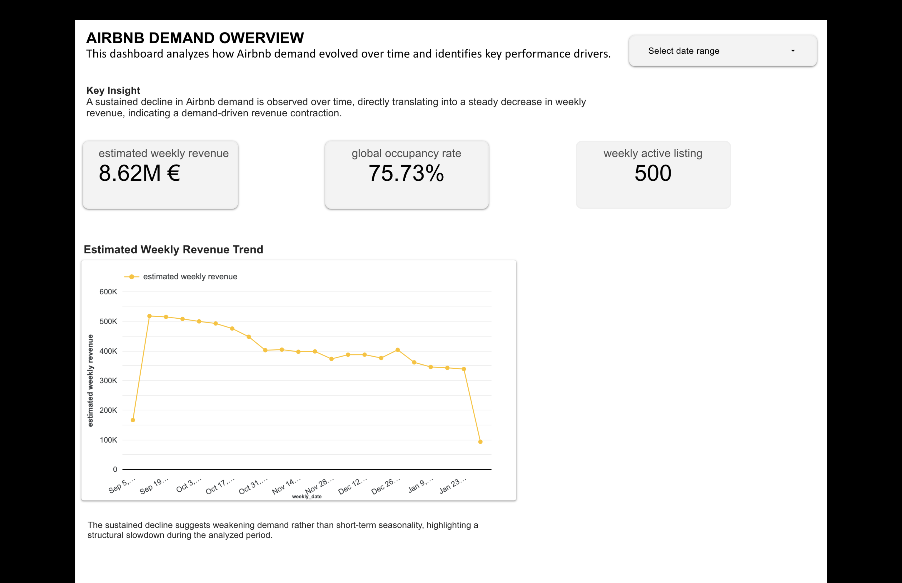
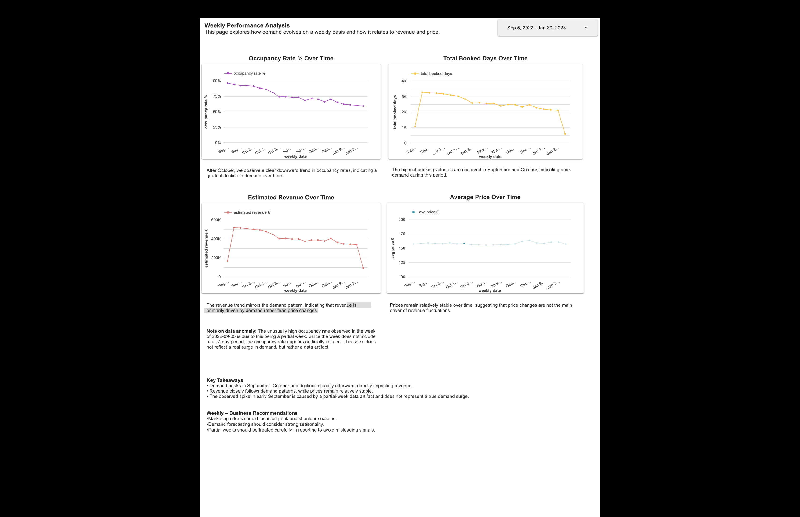
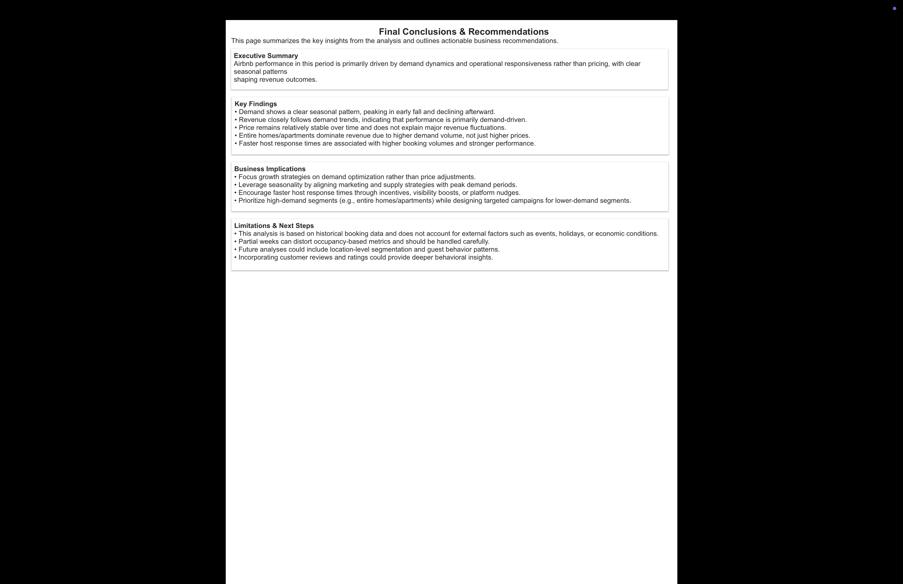

# 🏠 Airbnb Demand & Occupancy Analysis

This project analyzes Airbnb demand and occupancy trends over time using SQL in Google BigQuery.
The goal is to identify the busiest and least busy periods, understand demand dynamics, and evaluate whether revenue growth is driven by price changes or demand volume.

The project follows a production-style analytics workflow, from raw data validation to business-ready KPI tables used for visualization in Looker Studio.

---

## 🎯 Business Goal

Which periods are the busiest, and how does demand vary over time?

This analysis aims to:
- Identify peak and low-demand periods
- Understand how occupancy changes over time
- Evaluate the relationship between demand, pricing, and listing characteristics
- Support business decisions such as campaigns and demand-stimulation strategies

---

## 📊 Key KPIs

Occupancy Rate  
Percentage of booked days over total available capacity.

occupancy_rate = SUM(booked_days) / SUM(total_days)

Total Booked Days  
Total number of booked days per period.

Average Weekly Price  
Average listing price aggregated at weekly level.

Estimated Weekly Revenue  
Proxy revenue metric calculated as:

estimated_revenue = SUM(booked_days) × AVG(price)

Segment-Level Analysis  
KPIs are also analyzed by:
- Room type
- Host response time

---

## 🧱 Data Modeling & Architecture

This project follows a layered data model inspired by analytics engineering best practices.

Raw Layer (raw_data)

listing  
Granularity: 1 row = 1 listing  
Primary Key: id  

calendar  
Granularity: 1 row = 1 listing × 1 day  
Primary Key: (listing_id, date)

Intermediate Layer (intermediate)

weekly_calendar  
- Converts daily calendar data into weekly granularity  
- Computes base metrics such as booked_days, available_days, weekly_avg_price, and listing-level occupancy  

join_enriched  
- Joins weekly calendar data with listing attributes  
- Enables segmentation by room_type, host_response_time, and review_scores_value  

Mart Layer (mart)

weekly_performance  
Global weekly occupancy, pricing, and revenue metrics  

room_type_performance  
Performance metrics segmented by room type  

response_time_performance  
Performance metrics segmented by host response time  

---

## 🔍 Data Validation & Quality Checks

Before analysis, the dataset was systematically validated to ensure reliability:

- Granularity validation
- Primary key checks
- NULL value checks
- Numerical range checks (price, review scores)
- Categorical consistency checks
- Join integrity tests to prevent fan-out issues

These steps ensure that all KPIs are based on trustworthy data.

---

## 📈 Key Insights

Demand Patterns Over Time  
- The busiest periods occur in September and October  
- These periods show both higher occupancy rates and higher total booked days  

Price vs Demand  
- Prices remain relatively stable across all periods  
- Revenue growth is driven primarily by demand volume, not price increases  

Conclusion  
The business exhibits a volume-driven revenue structure.

Room Type Performance  
- Entire home/apt generates the highest revenue despite higher prices  
- Revenue is driven mainly by significantly higher booked days  

Host Response Time Impact  
- Faster host response times correlate with higher occupancy rates  
- Response time has a stronger impact on revenue than price differences  

---

## 🚀 Business Recommendations

- Focus demand-stimulation strategies during low-demand periods instead of raising prices
- Prioritize Entire home/apt listings due to strong demand volume
- Train and incentivize hosts to respond faster, improving occupancy and revenue

---

## 🛠 Tools & Technologies

Google BigQuery — SQL-based data analysis and modeling  
Looker Studio — Dashboarding and visualization  
GitHub — Version control and portfolio presentation  

---

## 📊 Dashboard

The final KPIs and insights are visualized in Looker Studio.

Public Looker Studio Dashboard:  
PASTE_YOUR_LOOKER_STUDIO_LINK_HERE

Dashboard Pages

Overview  

Weekly Performance  

Room Type Performance  

Response Time Performance  

Final Conclusions & Recommendations  

---

## 📁 Project Structure

airbnb-analytics/
│
├── sql/
│   ├── raw/
│   ├── intermediate/
│   └── mart/
│
├── visuals/
│
└── README.md

---

## 🧾 Conclusion

This project demonstrates an end-to-end analytics workflow, transforming raw Airbnb data into actionable business insights.

It showcases disciplined data validation, analytical SQL modeling, KPI-driven thinking, and business-oriented interpretation.

The project reflects how real-world analytics work goes beyond querying data to support decision-making.

---

## 🔖 Tags

#SQL #BigQuery #AnalyticsEngineering  
#AirbnbAnalytics #OccupancyAnalysis #DemandAnalysis  
#KPI #PortfolioProject

